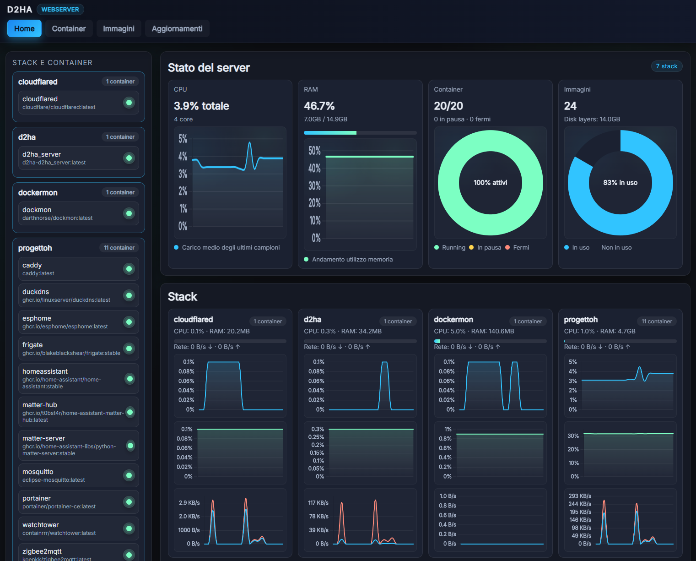
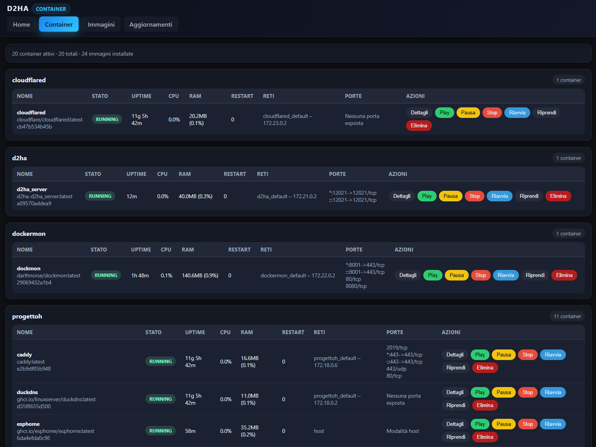
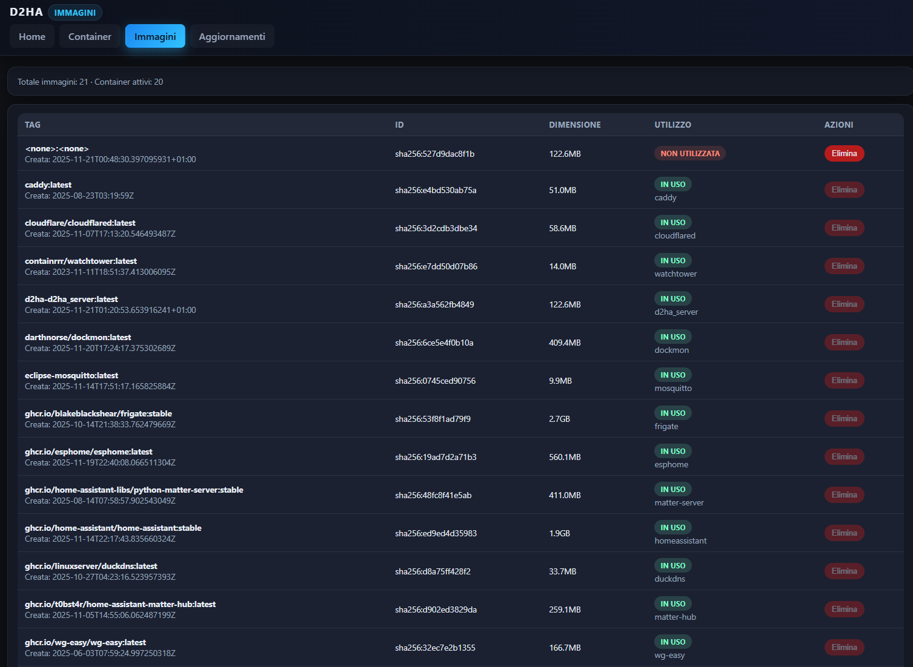
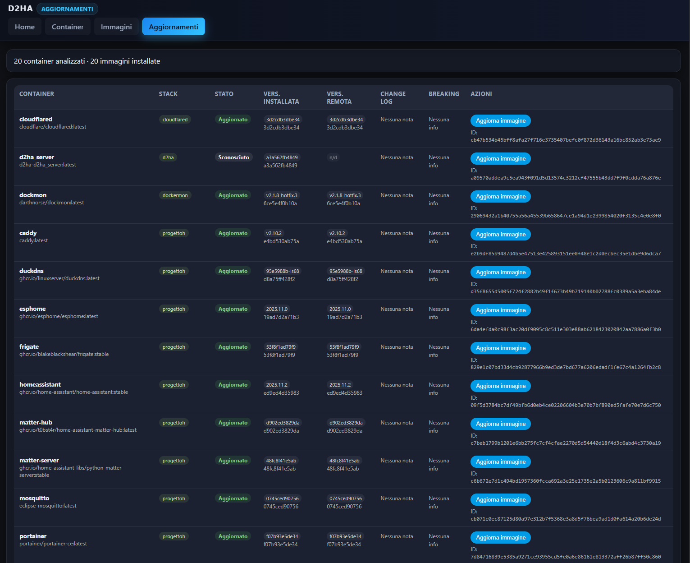
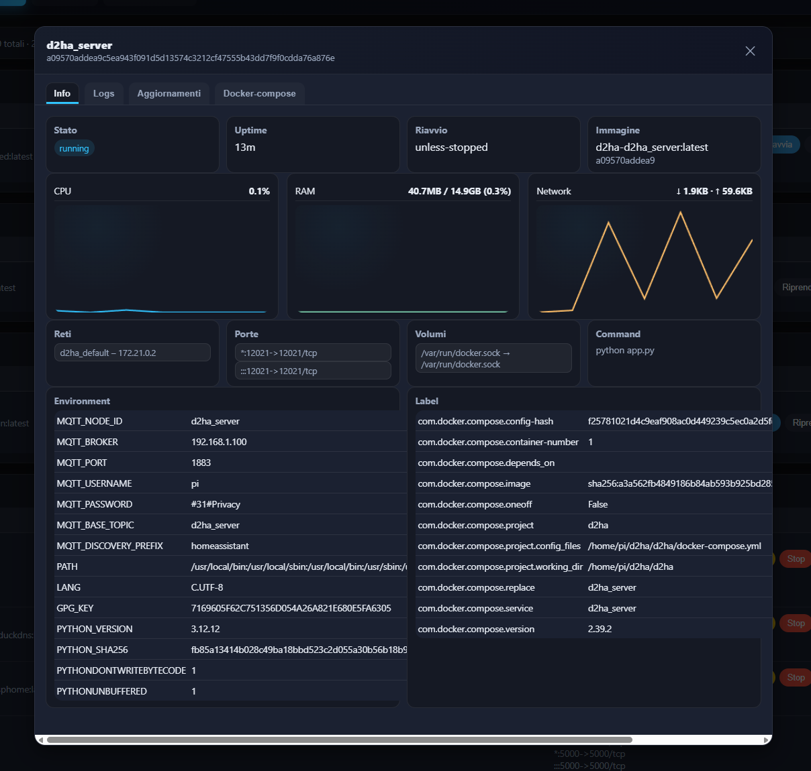

<h1 align="center">D2HA</h1>
<p align="center">
  <b>Docker to Home Assistant</b><br/>
  Monitora e controlla i container Docker da una dashboard moderna, con integrazione smart in Home Assistant.
</p>

<p align="center">
  
  
  
  
  
</p>

---

## ✨ Panoramica

**D2HA** è un webserver leggero che legge direttamente il socket Docker (`/var/run/docker.sock`) e ti offre:

- una **dashboard in tempo reale** per CPU, RAM, rete e stato dei container;
- controlli rapidi per **start / stop / restart / pause / unpause / delete / full update**;
- una **integrazione completa con Home Assistant** tramite MQTT (discovery automatico, sensori, switch, stato aggiornamenti).

Niente database, niente dipendenze strane: solo Docker, Flask e – se vuoi – MQTT.

---

## 📸 Screenshot

> UI dark, pensata per server headless e dashboard Home Assistant.

<p align="center">
  
</p>

<p align="center">
  
</p>

<p align="center">
  
</p>

<p align="center">
  
</p>

<p align="center">
  
</p>

> Suggerimento: salva gli screenshot nella cartella `docs/` del repo con gli stessi nomi per avere le anteprime funzionanti su GitHub.

---

## 🚀 Funzionalità principali

### Dashboard server

- Panoramica CPU / RAM del sistema.
- Numero container attivi, in pausa e fermi.
- Utilizzo immagini Docker (layers / spazio disco).
- Grafici live degli ultimi campioni.

### Stack & container

- Raggruppamento per **stack Docker Compose**.
- Per ogni container:
  - stato, uptime, CPU, RAM, rete;
  - porte esposte, volumi, rete;
  - pulsanti azione:
    - ▶️ Play (start)
    - ⏸ Pausa
    - ⏹ Stop
    - 🔁 Riavvia
    - 🔄 Full update (pull immagine + recreate)
    - 🗑 Elimina

### Immagini Docker

- Lista immagini installate con:
  - tag, ID, data di creazione;
  - dimensione e utilizzo;
  - associazione ai container che la usano.
- Possibilità di eliminare immagini non utilizzate.

### Gestione aggiornamenti

- Analisi di tutti i container installati.
- Confronto **versione installata vs versione remota**.
- Lettura automatica di label OCI per:
  - versione immagine;
  - changelog;
  - breaking changes.
- Azione “Aggiorna immagine” per eseguire pull + ricreazione container.

### Dettaglio container

Popup di dettaglio con:

- grafici CPU, RAM, rete;
- reti, porte, volumi;
- environment completo;
- label Docker / Compose;
- cronologia aggiornamenti;
- docker-compose associato (se disponibile).

### MQTT + Home Assistant (opzionale)

- Discovery automatico di:
  - `sensor` per stato, risorse e aggiornamenti;
  - `switch` per controllare i container.
- Comandi via MQTT:
  - `start`, `stop`, `restart`, `pause`, `unpause`, `full_update`.
- Stato pubblicato su un base topic configurabile (es. `d2ha_server`).

---

## 🧱 Architettura

- **Backend**
  - **Flask** per esporre le API JSON e servire l'interfaccia web statica.
  - **Paho MQTT** (opzionale) per pubblicare sensori e switch in Home Assistant.
  - Accesso diretto a **Docker Engine** tramite socket per evitare dipendenze dalla CLI.

- **Frontend**
  - Single Page Application minimalista, senza build step, ottimizzata per ambienti headless.
  - Grafici live con **Chart.js** e aggiornamenti via polling leggero.

- **Service layer**
  - Lettura dei container, immagini e stack tramite la libreria Python **docker SDK**.
  - Gestione aggiornamenti confrontando tag locali e remoti e leggendo label OCI.
  - Cache in memoria per ridurre le chiamate ripetute al daemon Docker.

- **Integrazione Home Assistant**
  - Discovery MQTT automatico (sensori e switch) con payload compatibili con la UI Lovelace.
  - Pubblicazione stati su topic dedicati con intervallo configurabile.

> Obiettivo: restare "batteries included" senza database, message queue o componenti aggiuntivi.

---

## 📋 Requisiti

- Docker Engine 20.10+ con accesso al socket `/var/run/docker.sock`.
- Python 3.11+ se esegui in modalità bare-metal.
- Accesso di rete al broker MQTT (solo se abiliti l'integrazione).
- Architetture testate: `amd64`, `arm64` (Raspberry Pi 4/5).

---

## 🔐 Autenticazione e onboarding

- **Credenziali iniziali:** `admin / admin`.
- Al **primo login** viene avviata una procedura guidata:
  - scelta di una nuova password (obbligatoria) e, se vuoi, di un nuovo username;
  - scelta se abilitare subito la **2FA TOTP** (Google Authenticator, Aegis, ecc.) o rimandare.
- La configurazione di sicurezza viene salvata nel file JSON `d2ha/auth_config.json` (creato automaticamente con permessi ristretti al primo avvio).
- Variabili utili:
  - `D2HA_SECRET_KEY` per impostare la chiave di sessione Flask (obbligatorio in produzione);
  - `D2HA_ADMIN_USERNAME` per personalizzare l'username iniziale prima del primo avvio.

> Suggerimento: esegui D2HA dietro a un reverse proxy HTTPS e considera la 2FA indispensabile se l'interfaccia è esposta in rete.

---

## 🛡️ Sicurezza

- **Rate limiting login:** dopo troppi tentativi falliti l'endpoint `/login` restituisce HTTP 429 per 15 minuti, rallentando attacchi bruteforce.
- **Pagina Sicurezza:** da `/settings/security` (anche dalla navbar) puoi cambiare username/password dell'admin e gestire la 2FA.
  - Ogni modifica richiede la password attuale e, se la 2FA è attiva, anche un codice TOTP valido.
  - L'abilitazione 2FA è guidata: viene mostrato il QR/URI da scansionare e viene richiesta una verifica esplicita del codice.
  - La disattivazione della 2FA richiede password + codice corrente.
- **Best practice:** esegui sempre dietro reverse proxy HTTPS (Caddy, Traefik, Nginx) e ricorda che chi accede a D2HA può controllare Docker sull'host.

---

## 🗂️ Struttura del progetto

```
d2ha/
├── app.py              # Entrypoint Flask
├── mqtt/               # Gestione discovery e stato MQTT
├── routes/             # Blueprint Flask (UI + API)
├── services/           # Logica per Docker, aggiornamenti, cache in memoria
├── static/             # HTML/CSS/JS della dashboard
└── templates/          # Layout Jinja2
```

---

## 🧪 Avvio in locale (sviluppo)

```bash
git clone https://github.com/Arborae/docker2homeassistant.git
cd docker2homeassistant

python -m venv .venv
source .venv/bin/activate      # Windows: .venv\Scripts\activate
pip install -r d2ha/requirements.txt

python d2ha/app.py
```

Per default l’app è disponibile su:

```text
http://localhost:12021
```

Assicurati che l’utente con cui la esegui abbia accesso a Docker  
(es. aggiungendolo al gruppo `docker` su Linux).

---

## 🐳 Esecuzione con Docker Compose

All’interno della cartella `d2ha/` (sotto `docker2homeassistant/`):

```bash
docker compose up --build -d
```

Questo:

- costruisce l’immagine dell’app;
- avvia il container in background;
- espone la UI su `http://<host>:12021`;
- monta `/var/run/docker.sock` nel container (se definito nel `docker-compose.yml`).

---

## 📡 Configurazione MQTT

L’integrazione MQTT è completamente opzionale.  
Se non configuri il broker, D2HA funziona come semplice dashboard web.

Variabili d’ambiente supportate:

- `MQTT_BROKER`
- `MQTT_PORT`
- `MQTT_USERNAME`
- `MQTT_PASSWORD`
- `MQTT_BASE_TOPIC`
- `MQTT_DISCOVERY_PREFIX`
- `MQTT_NODE_ID`
- `MQTT_STATE_INTERVAL` (secondi tra le pubblicazioni di stato)

Esempio `.env`:

```env
MQTT_BROKER=192.168.1.100
MQTT_PORT=1883
MQTT_USERNAME=homeassistant
MQTT_PASSWORD=password
MQTT_BASE_TOPIC=d2ha_server
MQTT_DISCOVERY_PREFIX=homeassistant
MQTT_NODE_ID=d2ha_server
MQTT_STATE_INTERVAL=5
```

Se `paho-mqtt` non è installato o la connessione fallisce:

- la parte MQTT viene disabilitata;
- la UI continua a funzionare normalmente.

---

## 🌐 Endpoint principali

UI:

- `GET /` – Dashboard principale
- `GET /containers` – Lista container
- `GET /images` – Immagini Docker
- `GET /updates` – Gestione aggiornamenti

API JSON (estratto):

- `GET /api/overview` – Panoramica host e stack
- `GET /api/containers/<id>/details` – Dettaglio container
- `GET /api/containers/<id>/stats` – Statistiche live
- `GET|POST /api/containers/<id>/updates` – Stato aggiornamenti / refresh
- `POST /api/containers/<id>/updates/frequency` – Frequenza scan
- `GET|POST /api/containers/<id>/compose` – docker-compose per il container
- `GET|POST /api/compose` – docker-compose principale
- `GET /api/containers/<id>/logs?tail=<N|all>` – Log container

---

## 🗺️ Roadmap

- Filtro avanzato e ricerca tra container / stack
- Grafici storici CPU/RAM (serie temporali)
- Tema light alternativo
- Template Lovelace pronti per Home Assistant
- Ruoli / permessi (lettura vs controllo)

---

## 🤝 Contributi

Sono benvenute:

1. Fai un **fork** del repository.
2. Crea un branch: `feature/mia-funzionalita`.
3. Aggiungi test o controlli di base dove ha senso.
4. Apri una **pull request** spiegando chiaramente le modifiche.

---

## 📄 Licenza

Questo progetto è distribuito sotto licenza **MIT**.  
Vedi il file [`LICENSE`](./LICENSE) per tutti i dettagli.
