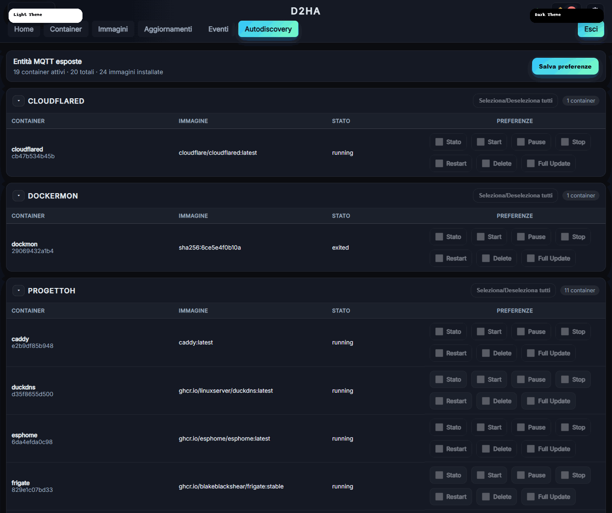

<h1 align="center">D2HA</h1>
<p align="center">
  <b>Docker to Home Assistant</b><br/>
  Monitora e controlla i container Docker da una dashboard moderna, con integrazione smart in Home Assistant.
</p>

<p align="center">
  <a href="https://github.com/Arborae/docker2homeassistant/actions/workflows/publish-docker.yml">
    
  </a>
  <a href="https://github.com/Arborae/docker2homeassistant/actions/workflows/nightly-docker.yml">
    
  </a>
</p>

<p align="center">
  <a href="https://github.com/Arborae/docker2homeassistant/releases">
    
  </a>
  <a href="https://ghcr.io/arborae/docker2homeassistant">
    
  </a>
</p>

<p align="center">
  
  
  
  
  
</p>

---

## ✨ Panoramica

**D2HA** è un webserver leggero che legge direttamente il socket Docker (`/var/run/docker.sock`) e ti offre:

- una **dashboard in tempo reale** per CPU, RAM, rete e stato dei container;
- controlli rapidi per **start / stop / restart / pause / unpause / delete / full update**;
- una **integrazione completa con Home Assistant** tramite MQTT (discovery automatico, sensori, switch, stato aggiornamenti);
- una UI curata con **theme switcher dark/light** e **multi‑lingua (IT/EN)**, dalla login page al wizard di onboarding;
- una **Progressive Web App (PWA)** installabile su Android/iOS/desktop, con service worker, manifest e supporto offline di base.

Niente database, niente dipendenze pesanti: solo Docker, Flask e – se vuoi – MQTT.

---

## 🎨 Tema dark / light

> L’interfaccia è pensata per server headless e dashboard Home Assistant, con un toggle rapido per passare da tema scuro a tema chiaro.

<p align="center">
  
</p>

---

## 📸 Panoramica UI

<p align="center">
  
</p>

<p align="center">
  
</p>

<p align="center">
  
</p>

<p align="center">
  
</p>

<p align="center">
  
</p>

---

## 🚀 Funzionalità principali

### Dashboard server

- Panoramica CPU / RAM del sistema.
- Numero container attivi, in pausa e fermi.
- Utilizzo immagini Docker (layers / spazio disco).
- Grafici live degli ultimi campioni.

### Stack & container

- Raggruppamento per **stack Docker Compose**.
- Per ogni container:
  - stato, uptime, CPU, RAM, rete;
  - porte esposte, volumi, rete;
  - pulsanti azione:
    - ▶️ Play (start)
    - ⏸ Pausa
    - ⏹ Stop
    - 🔁 Riavvia
    - 🔄 Full update (pull immagine + recreate)
    - 🗑 Elimina

### Immagini Docker

- Lista immagini installate con:
  - tag, ID, data di creazione;
  - dimensione e utilizzo;
  - associazione ai container che la usano.
- Possibilità di eliminare immagini non utilizzate.

### Gestione aggiornamenti

- Analisi di tutti i container installati.
- Confronto **versione installata vs versione remota** (basato sul digest dell'immagine).
- Lettura di **versione, changelog e breaking changes** da label/annotations OCI dell'immagine; in fallback, changelog/breaking dalle **release GitHub** del repo sorgente.
  - Imposta `D2HA_GITHUB_TOKEN` (token GitHub di sola lettura su repo pubblici) per alzare il rate limit della GitHub API (**60 → 5000 richieste/ora**) e mantenere affidabile il rilevamento del changelog.
  - Nota: per immagini che non pubblicano queste informazioni (molte immagini Docker Hub generiche) changelog/versione possono non essere disponibili — il confronto digest resta comunque affidabile.
- Azione “Aggiorna immagine” per eseguire pull + ricreazione container, con **avanzamento live** (fase, percentuale di download e log) nel popup di aggiornamento.

### Dettaglio container

Popup di dettaglio con:

- grafici CPU, RAM, rete;
- reti, porte, volumi;
- environment completo;
- label Docker / Compose;
- cronologia aggiornamenti;
- docker-compose associato (se disponibile).

### MQTT + Home Assistant (opzionale)

- Discovery automatico di:
  - `sensor` per stato, risorse e aggiornamenti;
  - `switch` per controllare i container.
- Comandi via MQTT:
  - `start`, `stop`, `restart`, `pause`, `unpause`, `full_update`.
- Stato pubblicato su un base topic configurabile (es. `d2ha_server`).

### App installabile (PWA)

- **Manifest** e **service worker** integrati: D2HA è installabile dal browser come app standalone su Android, iOS e desktop.
- I requisiti PWA (manifest, service worker registrato, icone 192/512) sono presenti su **tutte le pagine d'ingresso** (login, splash, dashboard), così l'installazione è offerta fin dalla schermata di accesso.
- Schermata di **splash** durante l'avvio del backend e cache di base degli asset statici per un primo caricamento più rapido.
- Funziona dietro reverse proxy HTTPS; se usi un gateway di autenticazione davanti all'app (es. **Cloudflare Access**) leggi la nota nella sezione **🛡️ Sicurezza**.

---

## 🧱 Architettura

- **Backend**
  - **Flask** per esporre le API JSON e servire l'interfaccia web statica.
  - **Paho MQTT** (opzionale) per pubblicare sensori e switch in Home Assistant.
  - Accesso diretto a **Docker Engine** tramite socket per evitare dipendenze dalla CLI.

- **Frontend**
  - Interfaccia server-rendered (Jinja2) minimalista, senza build step, ottimizzata per ambienti headless.
  - Grafici live con **Chart.js** e aggiornamenti via polling leggero.
  - **Theme switcher** (dark/light) e **multi‑lingua** applicati a tutte le pagine (login, onboarding, dashboard).
  - **PWA**: `manifest.json` + service worker (`sw.js`) per l'installazione come app e la cache di base.

- **Service layer**
  - Logica Docker organizzata in un **package modulare** (`services/docker/`) suddiviso per dominio: container, immagini/aggiornamenti, reti, volumi, sistema, eventi.
  - Lettura di container, immagini e stack tramite la libreria Python **docker SDK** (accesso diretto al socket).
  - Gestione aggiornamenti confrontando tag locali e remoti e leggendo label OCI.
  - Cache in memoria per ridurre le chiamate ripetute al daemon Docker.

- **Integrazione Home Assistant**
  - Discovery MQTT automatico (sensori e switch) con payload compatibili con la UI Lovelace.
  - Pubblicazione stati su topic dedicati con intervallo configurabile.

> Obiettivo: restare “batteries included” senza database, message queue o componenti aggiuntivi.

---

## 📋 Requisiti

- Docker Engine 20.10+ con accesso al socket `/var/run/docker.sock`.
- Python 3.11+ se esegui in modalità bare‑metal.
- Accesso di rete al broker MQTT (solo se abiliti l'integrazione).
- Architetture testate: `amd64`, `arm64` (Raspberry Pi 4/5).

---

## 🔐 Autenticazione e onboarding

- **Credenziali iniziali:** `admin / admin`.
- Al **primo login** viene avviata una procedura guidata che copre quattro passi:
  1. scelta di una nuova password (obbligatoria) e, se vuoi, di un nuovo username;
  2. abilita o salta la **2FA TOTP** (Google Authenticator, Aegis, ecc.);
  3. configurazione iniziale di **Modalità sicura** (on di default) e **Modalità prestazioni** (off di default);
  4. scelta del comportamento iniziale per l'autodiscovery MQTT: esporre o meno tutte le entità di default.
- Tutte le scelte restano modificabili dopo il primo avvio:
  - credenziali e 2FA dalla pagina Sicurezza;
  - Modalità sicura / prestazioni tramite l'icona a forma di ingranaggio nell'header;
  - entità MQTT dalla pagina Autodiscovery.
- La configurazione di sicurezza viene salvata nel file JSON `auth_config.json` (creato automaticamente con permessi ristretti al primo avvio). Per conservarla tra i rebuild puoi puntare il percorso con `D2HA_AUTH_CONFIG_PATH` (default `/app/data/auth_config.json`) e montare il volume `./data:/app/data` nel `docker-compose.yml`.
- Le preferenze di autodiscovery MQTT vengono salvate in `autodiscovery_preferences.json` nello **stesso percorso** di `auth_config.json` (o nel path indicato da `D2HA_AUTODISCOVERY_PREFS_PATH`) così da restare persistenti quando monti il volume `./data:/app/data`.
- Variabili utili:
  - `D2HA_SECRET_KEY` per impostare la chiave di sessione Flask (obbligatorio in produzione);
  - `D2HA_ADMIN_USERNAME` per personalizzare l'username iniziale prima del primo avvio.

> Suggerimento: esegui D2HA dietro a un reverse proxy HTTPS e considera la 2FA indispensabile se l'interfaccia è esposta in rete.

---

## 🛡️ Sicurezza

- **Protezione CSRF:** tutte le richieste di modifica via form HTML sono protette da token CSRF per-sessione; le API JSON sono esenti perché la Same-Origin Policy del browser impedisce richieste `application/json` cross-origin senza preflight.
- **Rate limiting login:** dopo troppi tentativi falliti l'endpoint `/login` restituisce HTTP 429 per 15 minuti, rallentando attacchi bruteforce. Il conteggio è basato sull'**IP reale del client** (header `CF-Connecting-IP` / `X-Forwarded-For` quando sei dietro un proxy), non sull'indirizzo del proxy.
- **Rate limiting API:** gli endpoint `/api/*` di scrittura sono limitati per IP per attenuare abusi e loop accidentali.
- **Modalità sicura:** quando attiva, le **azioni distruttive** (eliminazione di container e reti) richiedono una conferma esplicita; senza conferma l'API risponde con HTTP 403. L'interfaccia mostra un dialog di conferma prima di eliminare.
- **Timeout di sessione:** logout automatico per inattività, configurabile (default 30 minuti) dalla pagina Sicurezza.
- **Pagina Sicurezza:** da `/settings/security` (anche dalla navbar) puoi cambiare username/password dell'admin e gestire la 2FA.
  - Ogni modifica richiede la password attuale e, se la 2FA è attiva, anche un codice TOTP valido.
  - L'abilitazione 2FA è guidata: viene mostrato il QR/URI da scansionare e viene richiesta una verifica esplicita del codice.
  - La disattivazione della 2FA richiede password + codice corrente.
- **Redazione log:** i valori sensibili (secret key, password MQTT, hash/segreti) vengono oscurati nei log.
- **Best practice:** esegui sempre dietro reverse proxy HTTPS (Caddy, Traefik, Nginx) e ricorda che chi accede a D2HA può controllare Docker sull'host.

> **PWA dietro un gateway di autenticazione (Cloudflare Access / Zero Trust, Authelia, ecc.)**
> Se proteggi l'app con un gateway che intercetta ogni richiesta, l'installazione come PWA **non funziona** finché il manifest e il service worker non sono raggiungibili senza autenticazione: il browser li scarica **senza cookie** e riceverebbe la pagina di login del gateway invece dei file.
> Configura un **bypass pubblico** per i percorsi PWA — almeno `/sw.js` e `/static/*` (che includono `manifest.json` e le icone) — lasciando protetto il resto dell'app. Su Cloudflare Access: crea un'applicazione dedicata a quei percorsi con criterio **Bypass / Everyone**.

---

## 🗂️ Struttura del progetto

```text
d2ha/
├── app.py              # Entrypoint Flask, splash gating, logging
├── auth_store.py       # Lettura/scrittura di auth_config.json
├── csrf.py             # Protezione CSRF
├── rate_limiter.py     # Rate limiting API
├── i18n.py / theme.py  # Multi-lingua (IT/EN) e tema dark/light
├── version.py          # Versione (da D2HA_VERSION / git tag / SHA)
├── mqtt/               # Discovery e pubblicazione stato MQTT
├── routes/             # Blueprint Flask: ui.py, api.py, auth.py
├── services/
│   ├── docker/         # Package modulare: containers, images_updates,
│   │                   #   networks, volumes, system, events, base
│   ├── preferences.py  # Preferenze autodiscovery MQTT
│   └── utils.py        # Helper (human_bytes, slug, ecc.)
├── static/             # CSS/JS, icone, manifest.json, sw.js (PWA)
└── templates/          # Jinja2: layouts/, partials/, pagine
```

---

## 🧪 Avvio in locale (sviluppo)

```bash
git clone https://github.com/Arborae/docker2homeassistant.git
cd docker2homeassistant

python -m venv .venv
source .venv/bin/activate      # Windows: .venv\Scripts\activate
pip install -r d2ha/requirements.txt

python d2ha/app.py
```

Per default l’app è disponibile su:

```text
http://localhost:12021
```

Assicurati che l’utente con cui la esegui abbia accesso a Docker  
(es. aggiungendolo al gruppo `docker` su Linux).

---

## 🐳 Installazione via Docker / Docker Compose

Se preferisci usare direttamente le **immagini pronte su GitHub Container Registry (GHCR)**, puoi installare D2HA in pochi passi.

### 1. Scegli il tag dell'immagine

Immagine stabile (release):

```text
ghcr.io/arborae/docker2homeassistant:latest
ghcr.io/arborae/docker2homeassistant:X.Y.Z   # es. 0.1.1
```

Immagine di sviluppo (nightly):

```text
ghcr.io/arborae/docker2homeassistant:nightly
```

### 2. Esempio `docker-compose.yml`

Crea un file `docker-compose.yml` simile a questo:

```yaml
services:
  d2ha:
    image: ghcr.io/arborae/docker2homeassistant:latest
    container_name: d2ha
    restart: unless-stopped
    ports:
      - "12021:12021"
    volumes:
      - /var/run/docker.sock:/var/run/docker.sock:ro
      - ./data:/app/data
    environment:
      # Tag/versione dell'immagine in uso (passata anche al container)
      D2HA_VERSION: "latest"

      # Chiave segreta Flask (obbligatoria in produzione)
      D2HA_SECRET_KEY: "cambia-questa-chiave"

      # (Opzionale) Username admin iniziale prima del primo avvio
      # D2HA_ADMIN_USERNAME: "admin"

      # (Opzionale) Config MQTT
      # MQTT_BROKER: "192.168.1.100"
      # MQTT_PORT: "1883"
      # MQTT_USERNAME: "homeassistant"
      # MQTT_PASSWORD: "password"
      # MQTT_BASE_TOPIC: "d2ha_server"
      # MQTT_DISCOVERY_PREFIX: "homeassistant"
      # MQTT_NODE_ID: "d2ha_server"
      # MQTT_STATE_INTERVAL: "5"

      # (Opzionale) Token GitHub di sola lettura su repo pubblici: alza il rate
      # limit della GitHub API (60 -> 5000 req/ora) per il rilevamento changelog/breaking.
      # D2HA_GITHUB_TOKEN: "ghp_xxx"

    # Se vuoi buildare localmente invece di usare l'immagine:
    # build:
    #   context: ./d2ha
    #   dockerfile: ./d2ha/Dockerfile
    #   args:
    #     D2HA_VERSION: "latest"
```

Il volume `./data:/app/data` mantiene persistenti:

- `auth_config.json` (credenziali + 2FA + sicurezza)
- `autodiscovery_preferences.json` (sensori MQTT esposti)

### 3. Avvio del container

```bash
docker compose up -d
```

### 4. Aggiornare all’ultima versione

Per aggiornare alla **release stabile** più recente:

```bash
docker compose pull
docker compose up -d
```

Per passare alla **nightly**:

1. Cambia l’immagine nel `docker-compose.yml`:

   ```yaml
   image: ghcr.io/arborae/docker2homeassistant:nightly
   ```

2. Poi:

   ```bash
   docker compose pull
   docker compose up -d
   ```

---

## 📡 Configurazione MQTT

L’integrazione MQTT è completamente opzionale.  
Se non configuri il broker, D2HA funziona come semplice dashboard web.

Variabili d’ambiente supportate:

- `MQTT_BROKER`
- `MQTT_PORT`
- `MQTT_USERNAME`
- `MQTT_PASSWORD`
- `MQTT_BASE_TOPIC`
- `MQTT_DISCOVERY_PREFIX`
- `MQTT_NODE_ID`
- `MQTT_STATE_INTERVAL` (secondi tra le pubblicazioni di stato)

Esempio `.env`:

```env
MQTT_BROKER=192.168.1.100
MQTT_PORT=1883
MQTT_USERNAME=homeassistant
MQTT_PASSWORD=password
MQTT_BASE_TOPIC=d2ha_server
MQTT_DISCOVERY_PREFIX=homeassistant
MQTT_NODE_ID=d2ha_server
MQTT_STATE_INTERVAL=5
```

Se `paho-mqtt` non è installato o la connessione fallisce:

- la parte MQTT viene disabilitata;
- la UI continua a funzionare normalmente.

---

## 🌐 Endpoint principali

UI:

- `GET /` – Dashboard principale
- `GET /containers` – Lista container
- `GET /images` – Immagini Docker
- `GET /volumes` – Volumi Docker
- `GET /networks` – Reti Docker
- `GET /updates` – Gestione aggiornamenti
- `GET /events` – Log eventi
- `GET /autodiscovery` – Gestione entità MQTT esposte
- `GET /settings/security` – Impostazioni di sicurezza (credenziali, 2FA, timeout)

API JSON (estratto):

- `GET /api/overview` – Panoramica host e stack
- `GET /api/containers/<id>/details` – Dettaglio container
- `POST /api/containers/<id>/<action>` – Azione container (`start`/`stop`/`restart`/`pause`/`unpause`/`delete`/`kill`); le azioni distruttive richiedono `?confirm=1` se la modalità sicura è attiva
- `POST /api/containers/<id>/full_update` – Pull immagine + ricreazione container
- `GET /api/notifications` – Notifiche (aggiornamenti, eventi critici)
- `GET|POST /api/networks` – Lista / creazione reti Docker
- `GET /api/containers/<id>/stats` – Statistiche live
- `GET|POST /api/containers/<id>/updates` – Stato aggiornamenti / refresh
- `POST /api/containers/<id>/updates/frequency` – Frequenza scan
- `GET|POST /api/containers/<id>/compose` – docker-compose per il container
- `GET|POST /api/compose` – docker-compose principale
- `GET /api/containers/<id>/logs?tail=<N|all>` – Log container

Sistema / PWA:

- `GET /api/health` – Health check del backend (stato `starting`/`ready`)
- `GET /splash` – Schermata di avvio mentre il backend si prepara
- `GET /sw.js` – Service worker
- `GET /static/manifest.json` – Web app manifest

---

## 🗺️ Roadmap

- Filtro avanzato e ricerca tra container / stack
- Grafici storici CPU/RAM (serie temporali)
- Template Lovelace pronti per Home Assistant
- Ruoli / permessi (lettura vs controllo)

---

## 🤝 Contributi

Sono benvenute:

1. Fai un **fork** del repository.
2. Crea un branch: `feature/mia-funzionalita`.
3. Aggiungi test o controlli di base dove ha senso.
4. Apri una **pull request** spiegando chiaramente le modifiche.

---

## 📄 Licenza

Questo progetto è distribuito sotto licenza **MIT**.  
Vedi il file [`LICENSE`](./LICENSE) per tutti i dettagli.
